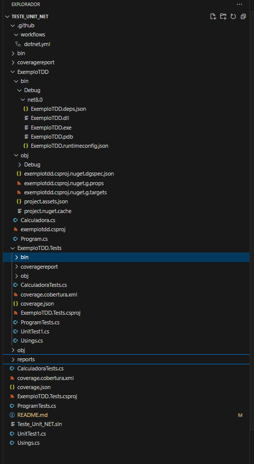

# Calculadora com Testes Unitários em .NET Core

Este projeto é uma calculadora simples desenvolvida em .NET Core, com foco na aplicação de Test-Driven Development (TDD) e testes unitários para garantir a robustez e a qualidade do código.

## Tecnologias Utilizadas

- .NET Core 8.0
- xUnit (para testes unitários)
- Coverlet (para cobertura de testes)
- ReportGenerator (para gerar relatórios de cobertura)
- GitHub Actions (para integração contínua)

## Estrutura de Arquivos

    /L:/VSCode/TESTES_MANUAIS/Teste_Unit_NET/
    ├── ExemploTDD
    │ ├── Calculadora.cs
    │ ├── Program.cs
    ├── ExemploTDD.Tests
    │ ├── CalculadoraTests.cs
    │ ├── ProgramTests.cs
    ├── reports
    │ └── index.html (gerado pelo reportgenerator)
    └── .github
    └── workflows
    └── dotnet.yml

## Técnicas Utilizadas

### Test-Driven Development (TDD)

Utilizamos a abordagem de TDD, onde os testes são escritos antes da implementação do código. O ciclo TDD consiste em:

    1. **Red**: Escrever um teste que inicialmente falha.
    2. **Green**: Escrever o código mínimo necessário para fazer o teste passar.
    3. **Refactor**: Refatorar o código garantindo que os testes continuem passando.

### Testes Unitários

Os testes unitários são escritos utilizando o framework xUnit. Eles garantem que cada funcionalidade da calculadora está funcionando corretamente.

### Cobertura de Testes

Utilizamos o Coverlet para medir a cobertura de testes e o ReportGenerator para gerar relatórios de cobertura em formato HTML.

### Integração Contínua (CI)

Configuramos o GitHub Actions para automatizar a execução dos testes e a geração dos relatórios de cobertura em cada push ou pull request.

## Testes Realizados

### Testes de Funcionalidade

1. **Adicionar**: Verifica se a soma de dois números está correta.
2. **Subtrair**: Verifica se a subtração de dois números está correta.
3. **Multiplicar**: Verifica se a multiplicação de dois números está correta.
4. **Dividir**: Verifica se a divisão de dois números está correta e lança uma exceção ao tentar dividir por zero.

### Testes de Cobertura

Medimos a cobertura de testes para garantir que todas as partes críticas do código estão cobertas.

## Como Executar o Projeto

### Pré-requisitos

- .NET Core 8.0 SDK
- Git

### Passos para Executar

1. Clone o repositório:

   git clone [https://github.com/IOVASCON/Tests_Unit_Net.git]
   cd Tests_Unit_Net

2. Restaure as dependências:

    dotnet restore

3. Execute os testes:

    dotnet test /p:CollectCoverage=true /p:CoverletOutputFormat=cobertura

4. Gere o relatório de cobertura:

    reportgenerator -reports:ExemploTDD.Tests/coverage.cobertura.xml -targetdir:reports

5. Abra o relatório de cobertura:

    Navegue até a pasta reports e abra o arquivo index.html em um navegador.

## Futuros Melhorias e Implementações

    Novas Funcionalidades: Adicionar mais operações matemáticas avançadas, como exponenciação e radiciação.
    Melhoria na Interface de Linha de Comando: Tornar a interface de linha de comando mais interativa.
    Testes de Performance: Adicionar testes de performance para verificar a eficiência das operações.
    Documentação: Expandir a documentação com exemplos de uso e guias de contribuição.

## Contribuição

Sinta-se à vontade para contribuir com este projeto. Basta seguir os passos abaixo:

    Faça um fork do repositório.
    Crie uma nova branch (git checkout -b feature/nova-funcionalidade).
    Faça as alterações desejadas e comite (git commit -m "Adiciona nova funcionalidade").
    Faça o push para a branch (git push origin feature/nova-funcionalidade).
    Abra um pull request no GitHub.

## Licença

Este projeto está licenciado sob a Licença MIT - veja o arquivo LICENSE para mais detalhes.
